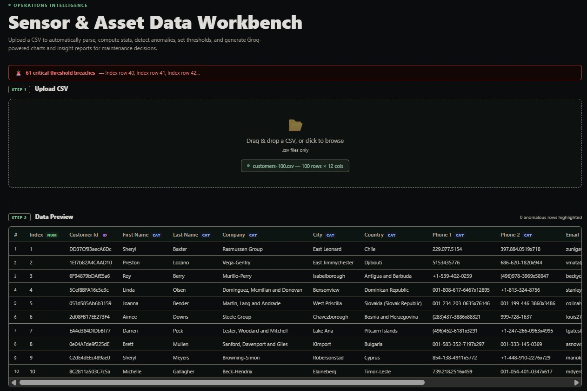
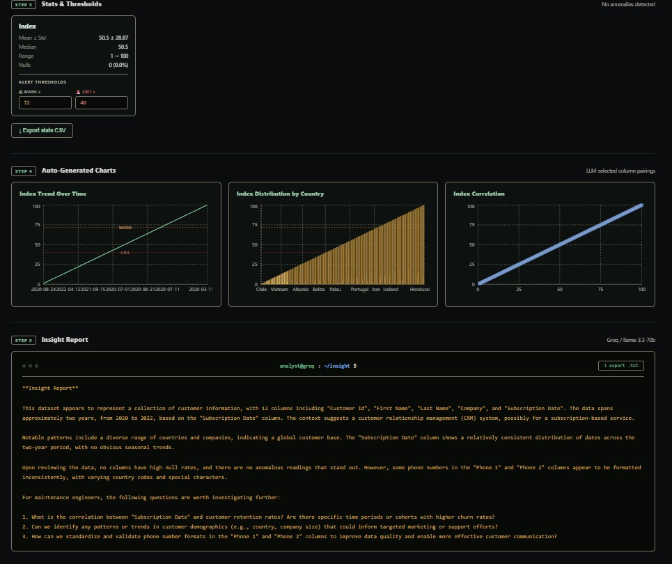

# CSV Data Analyst

A full-stack web app for operations and maintenance teams to drop in a CSV and instantly get parsed data, summary statistics, anomaly detection, configurable alert thresholds, auto-generated charts, and a plain-English insight report — all powered by Groq's LLM.

---

## Screenshots

> Replace the images below with your own after running the app.

**Upload & Data Preview**


**Stats, Thresholds & Charts**


---

## What It Does

Upload any CSV and the app automatically:

- **Parses and previews** the first 10 rows in a styled table with column type badges (`NUM`, `CAT`, `DATE`, `ID`)
- **Computes summary stats** for every numeric column: min, max, mean, median, std dev, null count
- **Detects anomalies** — flags rows where a value is more than 3σ from the column mean, with z-scores shown per card
- **Configurable alert thresholds** — set warn and critical limits per column; breaches surface as a banner at the top and as reference lines on charts
- **Renders 3 charts** automatically — LLM picks the most insightful column pairings (time-series trends, comparisons, correlations)
- **Generates a natural language insight report** — key findings, anomalies, correlations, and actionable next steps for a maintenance engineer
- **Export** — download the stats summary as CSV or the insight report as a `.txt` file

All CSV parsing and stats run in the browser. Only the LLM calls go to the server.

---

## Tech Stack

| Layer | Technology |
|---|---|
| Frontend | React + Vite |
| Charts | Recharts |
| CSV parsing | PapaParse (browser-side) |
| Backend | Node.js + Express |
| LLM | Groq API — `llama-3.3-70b-versatile` |
| Styling | CSS-in-JS, dark industrial theme |

---

## File Structure

```
/
├── server/
│   └── index.js              # Express server — /api/analyze and /api/insight
├── src/
│   ├── components/
│   │   ├── UploadZone.jsx     # Drag-and-drop CSV upload
│   │   ├── DataPreview.jsx    # First 10 rows, type badges, anomaly row highlighting
│   │   ├── StatsGrid.jsx      # Stats cards with anomaly counts + threshold inputs
│   │   ├── ChartPanel.jsx     # 3 auto-generated Recharts charts + threshold reference lines
│   │   └── InsightReport.jsx  # LLM prose report, terminal style, export button
│   ├── utils/
│   │   ├── csvParser.js       # PapaParse wrapper
│   │   ├── statsEngine.js     # Stats, anomaly detection (>3σ), threshold breach computation
│   │   └── typeDetector.js    # Column type sniffing
│   ├── App.jsx
│   └── main.jsx
├── screenshots/               # Add your own screenshots here
│   ├── screenshot-1.png
│   └── screenshot-2.png
├── .env                       # Your secrets (never commit this)
├── .env.example               # Template
├── index.html
├── vite.config.js
└── package.json
```

---

## Getting Started

### 1. Clone and install

```bash
git clone https://github.com/your-username/csv-data-analyst.git
cd csv-data-analyst
npm install
```

### 2. Set up your environment

```bash
cp .env.example .env
```

Open `.env` and add your Groq API key:

```env
GROQ_API_KEY=gsk_your_key_here
```

Get a free key at [console.groq.com](https://console.groq.com).

### 3. Run the app

```bash
npm run dev
```

This starts both the Vite dev server and the Express backend concurrently:

- Frontend: [http://localhost:5173](http://localhost:5173)
- API server: [http://localhost:8787](http://localhost:8787)

---

## Environment Variables

| Variable | Required | Description |
|---|---|---|
| `GROQ_API_KEY` | Yes | Your Groq API key |
| `PORT` | No | Express server port (default: `8787`) |

> **Note:** The `.env` file must be in the project root (same level as `package.json`), not inside `server/`.

---

## API Endpoints

### `POST /api/analyze`

Asks the LLM to pick the 3 most insightful chart combinations. Anomaly summaries are included in the prompt context so the LLM can prioritize flagged columns.

**Request body:**
```json
{
  "columns": [{ "name": "temperature", "type": "numeric" }],
  "stats": [{ "column": "temperature", "mean": 72.4, "std": 5.1, "anomalies": [] }],
  "compactCsv": "timestamp,temperature\n2024-01-01,71.2\n..."
}
```

**Response:**
```json
{
  "charts": [
    { "type": "line", "x": "timestamp", "y": "temperature", "title": "Temperature over time" }
  ]
}
```

### `POST /api/insight`

Generates a 200–300 word plain English insight report, referencing specific column names, anomalous values, and actionable questions for a maintenance engineer.

**Request body:** Same shape as `/api/analyze`.

**Response:**
```json
{
  "report": "This dataset appears to represent sensor readings from..."
}
```

---

## UI Walkthrough

### Step 1 — Upload
Full-width drag-and-drop zone. Accepts `.csv` files only. Shows file name, row count, and column count after parsing.

### Step 2 — Data Preview
Scrollable table of the first 10 rows. Column headers show a type badge. Rows containing anomalous readings are highlighted in red with a ⚠ marker on the offending cell.

### Step 3 — Stats & Thresholds
One card per numeric column showing mean ± std dev, median, min→max range, and null count. Cards with >10% nulls turn red. Cards with statistical anomalies show an orange badge with count and z-scores. Each card has inline **Warn** and **Critical** threshold inputs — set a value and breaches are immediately computed across all rows and shown in an alert banner at the top of the page.

### Step 4 — Charts
Three charts rendered with Recharts — line, bar, or scatter — chosen by the LLM. Warn and critical thresholds appear as dashed reference lines directly on the charts. Loading skeleton shown while Groq responds.

### Step 5 — Insight Report
A 200–300 word report in monospace amber text, like a terminal readout. The LLM is given anomaly context so it references specific readings by column and row. Includes a one-click export to `.txt`.

---

## Anomaly Detection

Statistical outliers are computed in the browser using z-scores. A reading is flagged as an anomaly if:

```
|value - column_mean| > 3 × column_std_dev
```

Anomalies are surfaced in three places: the data preview table, the stats card for that column, and the LLM insight prompt (so the report mentions them specifically).

---

## Edge Cases Handled

- Empty CSV with no data rows
- CSV with no numeric columns (all strings or categoricals)
- Single-column files
- LLM unavailable or API key missing — falls back to locally computed chart suggestions
- Groq JSON parse failures — sanitizer catches malformed responses and falls back gracefully

---

## Scripts

| Command | Description |
|---|---|
| `npm run dev` | Start both frontend and backend in parallel |
| `npm run client` | Vite dev server only |
| `npm run server` | Express API server only |
| `npm run build` | Production build |

---

## Common Issues

**"Groq chart selection skipped: GROQ_API_KEY is not configured"**  
Your `.env` file is missing or the key isn't being picked up. Make sure:
- The file is named exactly `.env` (not `.env.local` or `.env.txt`)
- It lives in the project root, not in `server/`
- The value has no spaces around `=` and no quotes: `GROQ_API_KEY=gsk_abc123`

**Charts show fallback instead of LLM-generated ones**  
This happens when the API key is missing or the Groq response couldn't be parsed. Check the terminal for `Raw Groq chart response:` to see what was returned.

**CORS errors in the browser**  
Make sure the Express server is running on port 8787 and that Vite's proxy in `vite.config.js` is forwarding `/api` requests correctly.

---
